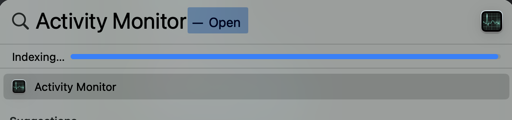
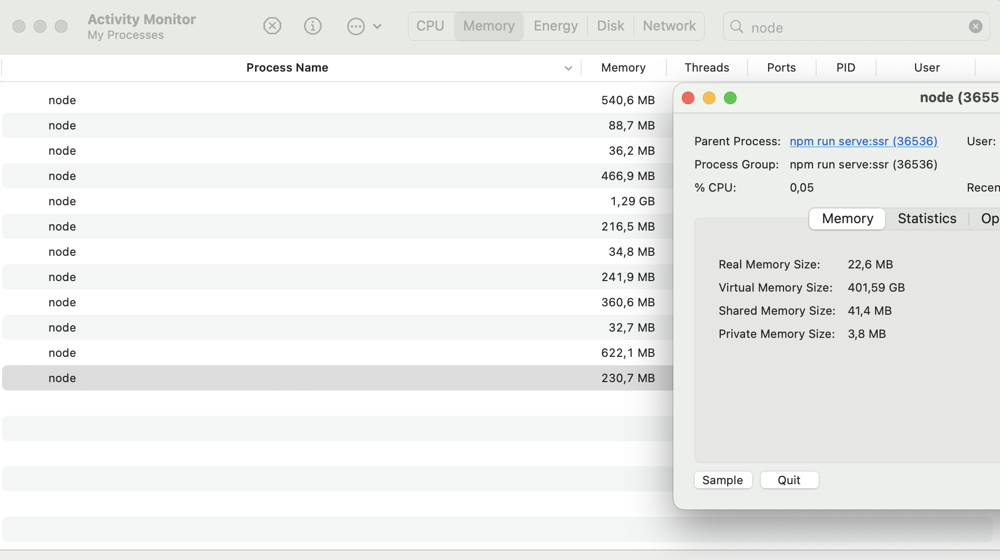
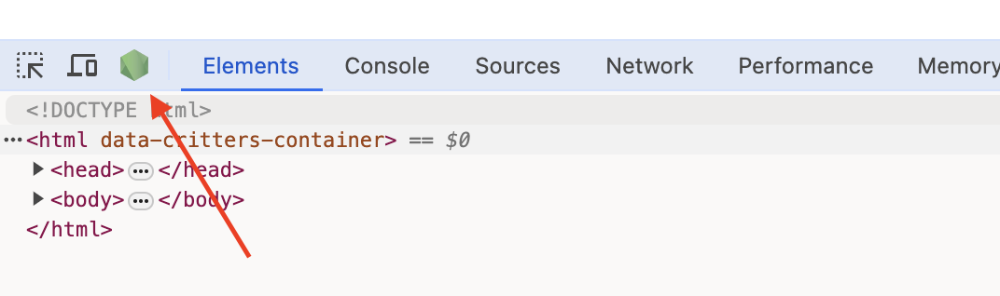
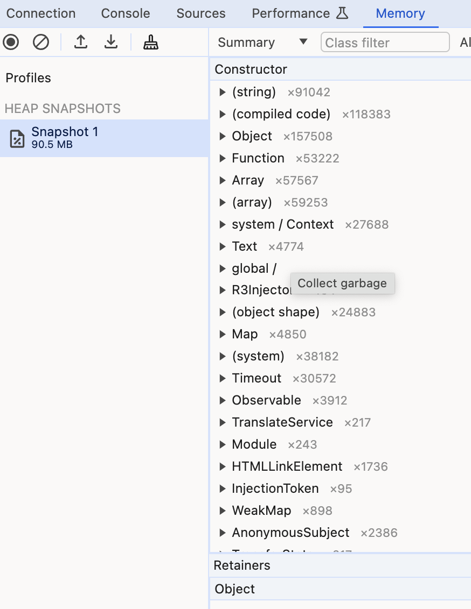
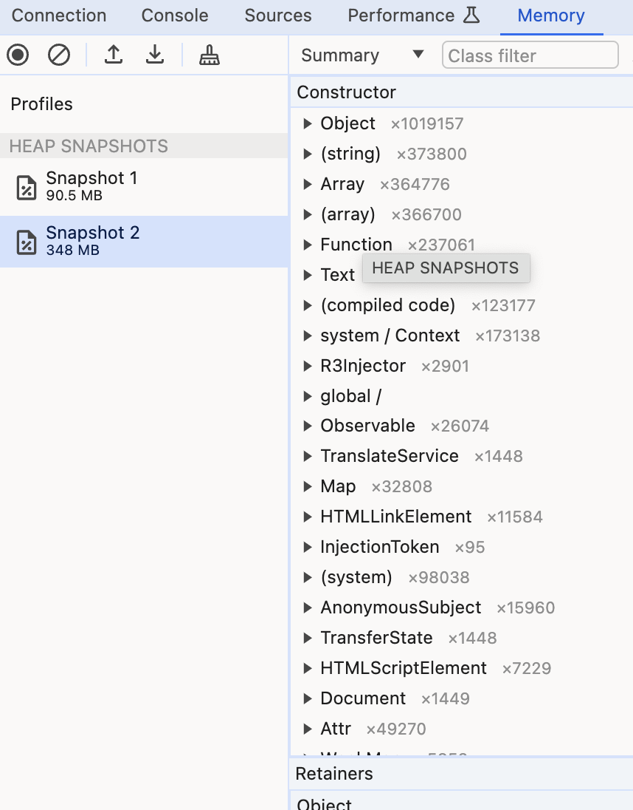

# HttpClient Memory Leak

## How to reproduce
### Prepare debugging stuff
1. Clone Repository on your local machine
 ```shell
 git clone https://github.com/dancornilov/http-client-memory-leak.git 
 ```
2. Install dependencies
 ```shell
 npm install 
 ```
3. Build application
 ```shell
 npm run build:ssr:local 
 ```
4. Serve SSR application
 ```shell
 npm run serve:ssr 
 ```
5. Open Activity Monitor to check memory usage and find your npm run serve:ssr process.
```shell
(Command + Space) and write Activity monitor
 ```

- type in search `node`
- then open each process and find which one is representative for serve process


6. Notice that when you server your SSR project in command was included `--inspect` that allows you to use debugger


7. Open DevTools and make initial snapshot


### Reproduce memory leak

1. Open new tab in your terminal and execute load testing.
For load testing we used [Artillery](https://www.artillery.io/docs).
 ```shell
 npm run load-test 
 ```
2. Notice how memory of serve process increase, and then make another snapshot


